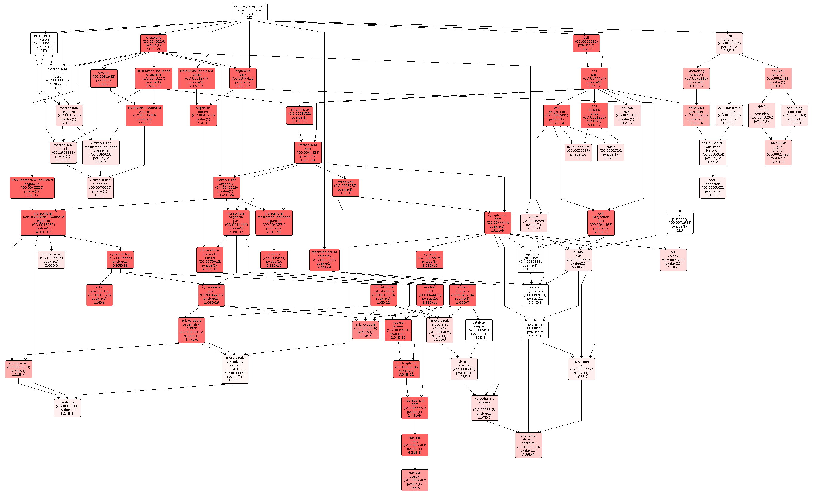

```{r setup, include=FALSE}
knitr::opts_chunk$set(echo = TRUE)
```

In this script, I'll identify enriched genes for mRNA regions, exons, and introns that overlap with DMLs. To do this, I'll use Uniprot accession codes with a [custom-built Gene Enrichment tool](https://meta.yeastrc.org/compgo_yaamini_oyster/pages/goAnalysisForm.jsp).


## Session information

```{r}
sessionInfo()
```

## Obtain GOterms

Before I do any sort of gene enrichment analysis, I need to get Uniprot codes for all genes. To do this, I will use `blastx`.

### Make a Uniprot Database

The Uniprot database was downloaded from this link as a .fasta file: http://www.uniprot.org/uniprot/?query=&fil=reviewed%3Ayes&columns=id%2Centry%20name%2Creviewed%2Cprotein%20names%2Cgenes%2Corganism%2Clength%2Cgo(biological%20process)%2Cgo-id%2Ccomment(PATHWAY)%2Cdatabase(UniPathway)%2Cdatabase(CDD)%2Cdatabase(Pfam.

```{bash}
head uniprot-filtered-reviewed.fasta #Check database creation
```

```{bash}
/Users/Shared/Apps/ncbi-blast-2.2.29+/bin/makeblastdb -help #Get the help menu
```

The first step involves taking the uniprot fasta file and making a new database. To do this, I will use the following code:

1. Path to `makeblastdb` to create the database needed
2. `in` to select the input file for the database
3. `dbtype` specifies the type of file which in our case, is a protein file

```{bash}
/Users/Shared/Apps/ncbi-blast-2.2.29+/bin/makeblastdb \
-in uniprot-filtered-reviewed.fasta \
-dbtype 'prot'
```

```{bash}
/Users/Shared/Apps/ncbi-blast-2.2.29+/bin/blastx -help
```

Now I can perform a `blastx` to compare my query, the *C. virginica* transcripts, to our protein database.

1. Path to `blastx`
2. `-query` provides the file we want to blast (*C. virginica* transcripts)
3.`-db` specifies database created in the previous step
4. `-outfmt` specifies the type of output file. I will use 6, a tabular file
5. `-out <filename>` will allow me to save the output as a new file
6. `-num_threads 4` uses 4 CPUs in the BLAST search
7. `-max_target_seqs 1` keeps only one aligned sequence (i.e. the best match)

```{bash}
pwd #Obtain present working directory
```

```{bash}
/Users/Shared/Apps/ncbi-blast-2.2.29+/bin/blastx \
-query 2018-09-06-Virginica-transcripts.fna \
-db uniprot-filtered-reviewed.fasta \
-outfmt 6 \
-out 2018-09-06-Transcript-Uniprot-blastx.txt \
-num_threads 4 \
-max_target_seqs 1
```

## mRNA overlaps

### Merge Uniprot codes with overlaps

The first thing I need to do is merge the txt file of DML-mRNA overlaps with the *C. virginica* genome-Uniprot codes.

```{bash}
head 2018-09-06-Transcript-Uniprot-blastx.txt #Check file format
```

```{bash}
head ../2018-06-11-DML-Analysis/2018-06-11-DML-mRNA.txt #Check file format
```

The IDs in the blast result match up with the Genbank IDs in the overlap file. I need to isolate the Genbank IDs before I can merge the files. I'm not sure how to do this file manipulation in bash or R, so I'll do this in Excel.

```{bash}
head 2018-09-11-DML-mRNA-unfolded.txt
```

Now I'll merge the two documents.

```{r}
blastResults <- read.delim("2018-09-06-Transcript-Uniprot-blastx.txt", header = FALSE, sep = "\t", dec = ".") #Import blast results
head(blastResults) #Confirm import
colnames(blastResults) <- c("Genbank", "Uniprot", "pident", "length", "mismatch", "gapopen", "qstart", "qend", "sstart", "send", "evalue", "bitscore")
head(blastResults) #Confirm column headers
```

```{r}
DMLmRNA <- read.delim("2018-09-11-DML-mRNA-unfolded.txt", header = FALSE) #Import DML-mRNA overlaps
head(DMLmRNA) #Confirm import
colnames(DMLmRNA) <- c("DMLchromosome", "DMLstart", "DMLend", "DMLstrand", "V5", "mRNAchromosome", "Gnomon", "mRNA", "mRNAstart", "mRNAend", "V11", "mRNAstrand", "V13", "ID", "Parent", "Dbxref=GeneID", "V17", "Genbank", "Name", "V20", "V21", "V22", "V23", "V24", "V25", "V26", "V27", "V28", "V29") #Rename columns
head(DMLmRNA) #Confirm column naming
```

```{r}
mRNADMLblast <- merge(x = blastResults, y = DMLmRNA, by = "Genbank") #Merge the two files by the Genbank ID column
head(mRNADMLblast) #Confirm merge
```

```{r}
write.csv(mRNADMLblast, "2018-09-11-mRNA-DML-Uniprot.csv") #Write out file
```

The next step is to isolate the Uniprot acession codes and input them into either DAVID or compGO. The reason why I want to use both DAVID and compGO is to compare the efficacy of the compGO tool.

### DAVID

For DAVID, I need to isolate the Uniprot accession codes from the transcript-blast results, and from my overlaps. This involves unfolding columns, which I can easily do in Excel.

```{bash}
head 2018-09-11-mRNA-DML-Uniprot-codeIsolated.csv #Confirm gene list isolation (P21783 is the code that was isolated)
```

```{bash}
head 2018-09-11-Transcript-Uniprot-blastx-codeIsolated.txt #Confirm background isolation (Q9JJZ5 is the code that was isolated)
```

I saved the gene list and background in a new file:

```{bash}
head 2018-09-11-DML-mRNA-Background-GeneList.csv #Confirm file creation
```

I can now use this information in DAVID. First, I copied the Uniprot accession codes for the gene list and pasted them into DAVID.


Then I added the codes for the background.


I received the following message in DAVID.


I obtained results. I downloaded all functional annotations, and individual GOterm lists.


#### ReVIGO

I opened the GOterm files for biological processes, cellular components, and molecular functions. I pasted significant GOterms and p-values into [ReViGO](http://revigo.irb.hr) to generate the following figures. For each category, I created a plot with medium term similarity, and either sizes based on logSize or log10p-value.

*Biological processes*:

Processes include cytoskeleton and microtubule movement, cell cycle, and protein activity. The most interesting results were those related to DNA and reproduction. DNA replication, mRNA processing, positive regulation of transcription from RNA polymerase II promoters, and response to DNA damage were all enriched. Additionally, positive regulation of histone H3-K9 acetylation, methylation-dependent chromatin silencing, DNA methylation involved in gamete generation, and fertilization point to mechanisms for epigenetic inheritance.


*Cellular components*:

Cellular components involved in enriched processes included protein complexes, transcription factor complexes, chromosomes, centromeres, microtubules, and cilia.


*Molecular function*:

Molecular functions of enriched processes include GTPase and ATPase activity, helicase activity, microtuble motor activity, protein kinase binding and activity, transcription regulatory region DNA binding, general DNA binding, and ion binding.


My input list of significant GOterms is pretty long because I'm using p-values, and not corrected p-values. With my [biological processes](2018-09-11-DAVID-Output/2018-09-11-DML-mRNA-BPGO.txt), using a corrected list of p-values would only give me one enriched term, and that's not interesting. Instead, I'm going to set a fold enrichment cut-off of 10. Any term with a fold enrichment higher than 10 will be used in ReVIGO.

#### Fold Enrichment ReVIGO

### `compGO`

I would like to compare the DAVID output with `compGO`, since `compGO` is essentially a specialized version of DAVID with a background that Mike Riffle custom built from my `blastx` results. The tool can be accessed [here](https://meta.yeastrc.org/compgo_yaamini_oyster/pages/goAnalysisForm.jsp).

`compGO` provides both reports (found [here](2018-09-16-compGO-Output/)) and visualizations, using a p-value cutoff of 1e-2. One thing that `compGO` does better than DAVID is filter down results. Even with the DAVID output, I had to filter p-values or fold enrichment values to get meaningful visualizations. `compGO` makes this easier by generating visuals that link similar GOterms with umbrella terms. Overrepresented biological processes include cytoskeletal growth and reorganization, transcription and translation regulation, and metabolic processes.





## Exon overlaps

### `intersect` overlaps with gene information

I can now do the same thing with my exon and intron overlaps!

```{bash}
head ../2018-06-11-DML-Analysis/2018-06-11-DML-Exon.txt #Check file format
```

The exon overlaps only have chromosome and position information, not gene information. I have to first `intersect` these overlaps using bedTools, then proceed with gene enrichment.

```{bash}
/Users/Shared/bioinformatics/bedtools2/bin/intersectBed -h #Load help menu
```

I need:

1. The path to `intersectBed`
2. `-wao`: Write the original A and B entries plus the number of base pairs of overlap between the two features. However, A features w/o overlap are also reported with a NULL B feature and overlap = 0
3. Path to the DML-exon overlaps
4. Path to the mRNA gff
5. Path for output

```{bash}
/Users/Shared/bioinformatics/bedtools2/bin/intersectBed \
-wao \
-a ../2018-06-11-DML-Analysis/2018-06-11-DML-Exon.txt \
-b ../2018-06-11-DML-Analysis/C_virginica-3.0_Gnomon_mRNA.gff3 \
> 2018-09-16-DML-Exon-mRNA-Overlaps.txt
```

```{bash}
head 2018-09-16-DML-Exon-mRNA-Overlaps.txt
```

Yay it worked!

### Merge Uniprot codes with overlaps

First, I need to unfold the gene IDs from the file I just generated.

```{bash}
head 2018-09-16-DML-Exon-mRNA-Overlaps.txt
```

```{r}
DMLExon <- read.delim("2018-09-16-DML-Exon-mRNA-Overlaps.txt", header = FALSE) #Import DML-exon-mRNA overlaps
head(DMLExon) #Confirm import
colnames(DMLExon) <- c("DMLchromosome", "DMLstart", "DMLend", "DMLstrand", "methDiff", "exonChromosome", "exonStart", "exonEnd", "mRNAchromosome", "Gnomon", "mRNA", "mRNAstart", "mRNAend", "V14", "mRNAstrand", "V15", "V16", "V17", "ID", "Parent", "Dbxref=GeneID", "V22", "Genbank", "Name", "V25", "V26", "V27", "V28", "V29", "V30", "V31", "V32", "V33", "V34") #Rename columns
head(DMLExon) #Confirm column naming
```

```{r}
exonDMLBlast <- merge(x = blastResults, y = DMLExon, by = "Genbank") #Merge the two files by the Genbank ID column
head(exonDMLBlast) #Confirm merge
```

```{r}
write.csv(exonDMLBlast, "2018-09-16-Exon-DML-Uniprot.csv") #Write out file
```

### `compGO`

## Intron overlaps

### `intersect` overlaps with gene information

```{bash}
/Users/Shared/bioinformatics/bedtools2/bin/intersectBed \
-wao \
-a ../2018-06-11-DML-Analysis/2018-06-11-DML-Intron.txt \
-b ../2018-06-11-DML-Analysis/C_virginica-3.0_Gnomon_mRNA.gff3 \
> 2018-09-16-DML-Intron-mRNA-Overlaps.txt
```

```{bash}
head 2018-09-16-DML-Intron-mRNA-Overlaps.txt
```

### Merge Uniprot codes with overlaps

I unfolded the Genbank IDs:

```{bash}
head 2018-09-16-DML-Intron-mRNA-Overlaps.txt
```

```{r}
DMLIntron <- read.delim("2018-09-16-DML-Intron-mRNA-Overlaps.txt", header = FALSE) #Import DML-intron-mRNA overlaps
head(DMLIntron) #Confirm import
colnames(DMLIntron) <- c("DMLchromosome", "DMLstart", "DMLend", "DMLstrand", "methDiff", "intronChromosome", "intronStart", "intronEnd", "mRNAchromosome", "Gnomon", "mRNA", "mRNAstart", "mRNAend", "V14", "mRNAstrand", "V15", "V16", "V17", "ID", "Parent", "Dbxref=GeneID", "V22", "Genbank", "Name", "V25", "V26", "V27", "V28", "V29", "V30", "V31", "V32", "V33", "V34") #Rename columns
head(DMLIntron) #Confirm column naming
```

```{r}
intronDMLBlast <- merge(x = blastResults, y = DMLIntron, by = "Genbank") #Merge the two files by the Genbank ID column
head(intronDMLBlast) #Confirm merge
```

```{r}
write.csv(intronDMLBlast, "2018-09-16-Intron-DML-Uniprot.csv") #Write out file
```

### `compGO`


## Flanking overlaps

## All elements

## Comparisons

### mRNA-Exon comparison

### mRNA-Intron comparison


### Exon-Intron comparison